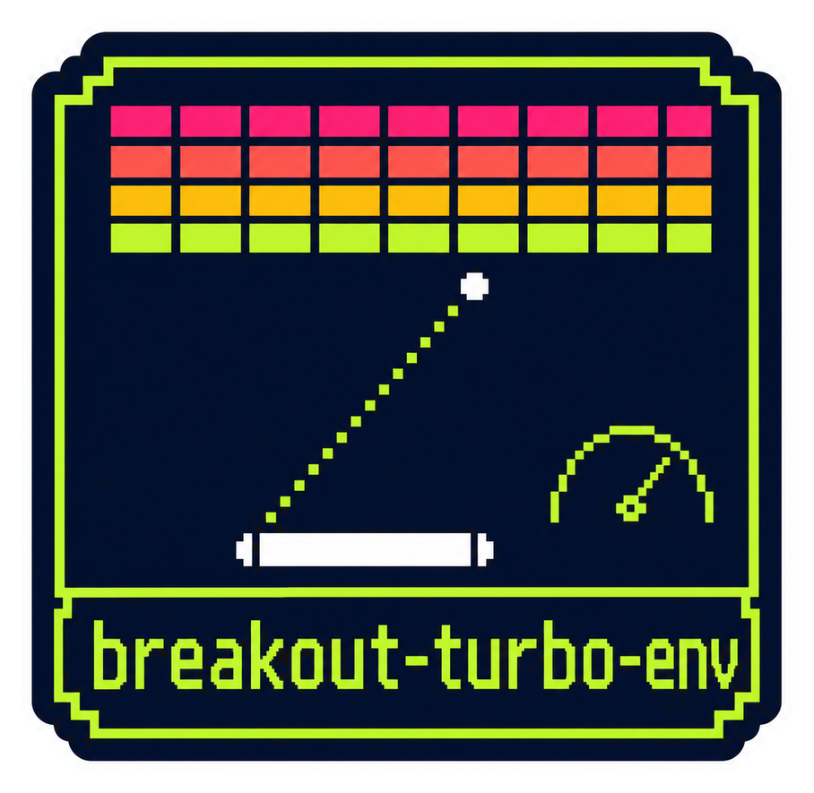
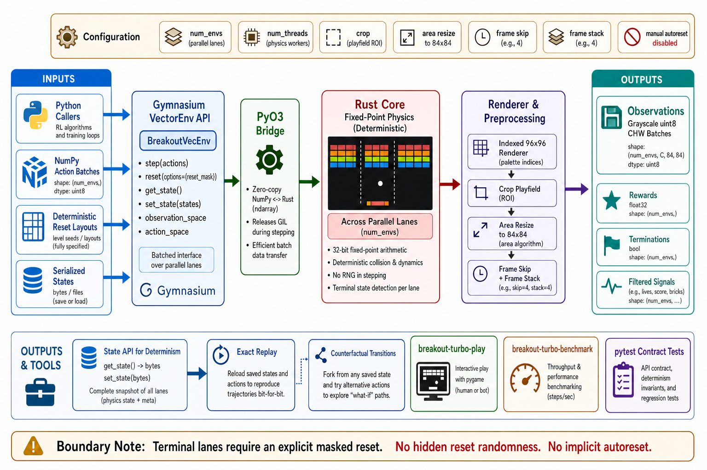

<div align="center">
  

  **🕹️ Blazing-fast, deterministic Breakout for Reinforcement Learning 🕹️**
</div>

breakout-turbo-env is a Python library for running many deterministic Breakout games at once. It gives reinforcement-learning researchers and engineers reproducible transitions, policy-ready observations, and a Gymnasium vector-environment API. Install the package, create `BreakoutVecEnv`, and step every game with one NumPy action batch.

Fixed-point Rust physics owns game state and parallel stepping. Python exposes the Gymnasium lifecycle, rendering, snapshots, and branching helpers.

## Install

Requires Python 3.11+.

```bash
pip install breakout-turbo-env
```

The core environment depends only on Gymnasium and NumPy. Install optional
tools explicitly when needed:

```bash
pip install "breakout-turbo-env[play]"   # interactive Pygame player
pip install "breakout-turbo-env[train]"  # local PPO training with PyTorch
```

To work from source, install [uv](https://docs.astral.sh/uv/) and a Rust toolchain, then run:

```bash
git clone https://github.com/tsilva/breakout-turbo-env.git
cd breakout-turbo-env
uv sync --extra dev --extra play --extra train
make develop-release
```

Import `BreakoutVecEnv` from the installed environment:

```python
import numpy as np
from breakout_turbo_env import BreakoutVecEnv

env = BreakoutVecEnv(num_envs=4096, num_threads=8)
obs, infos = env.reset()
obs, rewards, terminated, truncated, infos = env.step(
    np.zeros(env.num_envs, dtype=np.uint8)
)

done = terminated | truncated
if done.any():
    obs, reset_infos = env.reset(options={"reset_mask": done})

env.close()
```

## Commands

```bash
uv run --extra play breakout-turbo-env play    # open the interactive player
uv run --extra play breakout-turbo-env play --uncapped  # visible play without an FPS limit
uv run breakout-turbo-env benchmark            # measure the fixed 16-lane policy path
uv run pytest                                  # run Python contract and regression tests
cargo test --lib                               # run Rust library tests
uv run python train.py jerk                    # train a deterministic JERK action tape
uv run --extra train python train.py ppo       # train a PPO policy
uv run --extra play python play.py jerk        # replay the newest JERK policy
uv run --extra play python play.py ppo         # replay the newest PPO policy
make release                                   # validate, tag, and publish a release
```

For player, benchmark, training, and replay options, append `--help` to the corresponding command.

## Notes

- The standard observation batch is grayscale `uint8`, CHW, and defaults to `(num_envs, 4, 84, 84)`. Actions are `0` (noop), `1` (left), and `2` (right). Rewards match Stable Retro's Breakout scenario: each reward is the score delta, using `7, 7, 4, 4, 1, 1` points from the top brick row to the bottom, with no life-loss penalty or board-clear bonus.
- The environment is manual-reset only: after a terminal lane, call `reset(options={"reset_mask": mask})` before stepping that lane again. Built-in layouts are `full`, `checker`, `tunnel`, and `sparse`.
- `render()` returns the native 160×210 RGB frame geometry and Stella palette used by Stable Retro for Atari 2600 Breakout; training observations remain a separate processed 96×96 grayscale source stack. The interactive player accepts Left/Right or A/D, Space or R to reset, P to pause, and Escape to quit.
- PyPI provides wheels for macOS 11+ on Apple silicon and glibc 2.28+ Linux on x86-64. Other platforms require a source build.
- Training outputs live in `runs/<algorithm>/<timestamp>/`. JERK policies use `policy.json`; PPO policies use `policy.npz`.
- `make release` requires a clean branch synchronized with its upstream. The release workflow builds and audits macOS arm64 and Linux x86_64 wheels before publishing to PyPI.

## Architecture



## License

[MIT](https://opensource.org/license/mit/)
